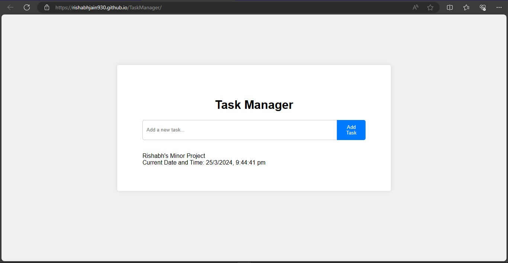
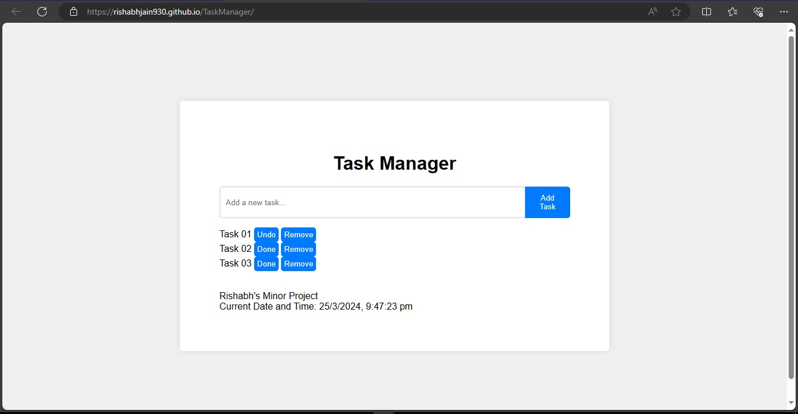

# Task Manager

This simple Task Manager web application allows you to keep track of your tasks. You can add, mark as completed, undo completion, and remove tasks as needed. The application is built using HTML, CSS, and JavaScript.

## Features

- Add new tasks
- Mark tasks as completed or undo completion
- Remove tasks
- Automatically saves tasks locally
- Displays current date and time

## Deployment

The project is deployed and accessible online. You can access it [here](https://rishabhjain930.github.io/TaskManager/).

## Preview

